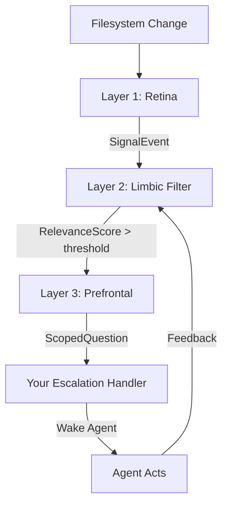

This guide will walk you through creating your first proactive agent with Macroa Pulse. You'll learn how to detect filesystem changes and trigger agent actions without cron jobs, webhooks, or LLM polling.

## What You'll Build

A simple agent that monitors a directory for new `.txt` files and escalates when one appears. This demonstrates the core Pulse workflow:

1. **Layer 1 (Retina)** detects the filesystem change
2. **Layer 2 (Limbic)** scores the event for relevance
3. **Layer 3 (Prefrontal)** forms a specific question for the agent

## Setup

<Steps>
  <Step title="Create a working directory">
    First, create a directory to monitor:

    ```bash
    mkdir ~/pulse_demo
    ```
  </Step>

  <Step title="Import Macroa Pulse">
    Create a new Python file and import the required components:

    ```python
    import time
    from pulse import PulseRegistry, EscalationDecision
    ```
  </Step>

  <Step title="Initialize the Pulse registry">
    The `PulseRegistry` is the top-level coordinator. Pass it the directories to watch:

    ```python
    registry = PulseRegistry(
        watch_dirs=["~/pulse_demo"],
        threshold=0.65  # Relevance score threshold (0.0-1.0)
    )
    ```

    <Note>
      The `threshold` parameter controls how selective the Pulse is. Lower values (e.g., 0.3) trigger more often; higher values (e.g., 0.8) are more conservative.
    </Note>
  </Step>

  <Step title="Register a module with a fingerprint">
    Modules describe what signals are relevant using a **signal fingerprint**:

    ```python
    registry.register_module(
        "document-agent",
        {
            "module_id": "document-agent",
            "cluster": "documents",
            "version": "1.0",
            "question_template": "A new file appeared at {location}. Is this relevant to the user's work?",
            "default_threshold": 0.65,
            "signal_priors": {
                "filesystem": {
                    "watch_directories": ["~/pulse_demo"],
                    "relevant_extensions": [".txt", ".pdf", ".docx"],
                    "irrelevant_extensions": [".tmp", ".log"]
                }
            }
        }
    )
    ```

    <Tip>
      The fingerprint provides priors that initialize the neural network on day one. The Pulse learns from feedback over time and adapts to your actual usage patterns.
    </Tip>
  </Step>

  <Step title="Subscribe to escalations">
    When the Pulse decides something is worth attention, it calls your escalation handler:

    ```python
    def handle_escalation(decision: EscalationDecision):
        print(f"🔔 Pulse escalation:")
        print(f"   Module: {decision.module_id}")
        print(f"   Question: {decision.question}")
        print(f"   Confidence: {decision.confidence:.2f}")
        
        # This is where you'd wake your agent with the scoped question
        # For now, we'll just print it

    registry.on_escalation(handle_escalation)
    ```

    The `EscalationDecision` contains:
    - `module_id` - Which module triggered
    - `question` - The specific question formed by Layer 3
    - `confidence` - The relevance score from Layer 2
    - `should_escalate` - Whether to wake the agent
  </Step>

  <Step title="Start the Pulse">
    Start all three layers:

    ```python
    registry.start()
    print("Pulse is running. Monitoring ~/pulse_demo for changes...")
    ```

    <Note>
      The Pulse runs in background threads. Your main program continues executing.
    </Note>
  </Step>

  <Step title="Test the system">
    Keep the script running and create a new file in the monitored directory:

    ```bash
    echo "Hello, Pulse!" > ~/pulse_demo/test.txt
    ```

    Within a few seconds, you should see:

    ```
    🔔 Pulse escalation:
       Module: document-agent
       Question: A new file appeared at ~/pulse_demo/test.txt. Is this relevant to the user's work?
       Confidence: 0.72
    ```
  </Step>

  <Step title="Provide feedback (optional)">
    After handling an escalation, provide feedback to improve the model:

    ```python
    def handle_escalation(decision: EscalationDecision):
        # ... handle the decision ...
        
        # Record activation and get an ID
        activation_id = registry.record_activation(
            decision.module_id,
            decision.triggering_events
        )
        
        # Later, after the agent acts, provide feedback
        # 1.0 = useful, 0.0 = not useful
        registry.record_feedback(activation_id, 1.0)
    ```

    <Tip>
      Feedback enables online learning. The Pulse adapts to your usage patterns without manual retraining.
    </Tip>
  </Step>

  <Step title="Graceful shutdown">
    When done, stop the Pulse and save model weights:

    ```python
    registry.stop()
    print("Pulse stopped.")
    ```
  </Step>
</Steps>

## Complete Example

Here's the full working example:

```python
import time
from pulse import PulseRegistry, EscalationDecision

def main():
    # Initialize registry
    registry = PulseRegistry(
        watch_dirs=["~/pulse_demo"],
        threshold=0.65
    )
    
    # Register a module
    registry.register_module(
        "document-agent",
        {
            "module_id": "document-agent",
            "cluster": "documents",
            "version": "1.0",
            "question_template": "A new file appeared at {location}. Is this relevant?",
            "default_threshold": 0.65,
            "signal_priors": {
                "filesystem": {
                    "watch_directories": ["~/pulse_demo"],
                    "relevant_extensions": [".txt", ".pdf", ".docx"],
                    "irrelevant_extensions": [".tmp", ".log"]
                }
            }
        }
    )
    
    # Handle escalations
    def handle_escalation(decision: EscalationDecision):
        print(f"🔔 {decision.module_id}: {decision.question}")
        print(f"   Confidence: {decision.confidence:.2f}")
    
    registry.on_escalation(handle_escalation)
    
    # Start and run
    registry.start()
    print("Pulse is running. Press Ctrl+C to stop.")
    
    try:
        while True:
            time.sleep(1)
    except KeyboardInterrupt:
        registry.stop()
        print("\nPulse stopped.")

if __name__ == "__main__":
    main()
```

## Understanding Signal Fingerprints

The signal fingerprint is how you describe what matters to your module. It contains:

<CodeGroup>
```json Filesystem Signals
{
  "filesystem": {
    "watch_directories": ["~/Downloads", "~/Documents"],
    "relevant_extensions": [".pdf", ".docx", ".pptx"],
    "irrelevant_extensions": [".exe", ".zip", ".mp3"]
  }
}
```

```json Memory Signals
{
  "memory": {
    "watch_namespaces": ["/mem/homework/", "/mem/courses/"],
    "high_relevance_keys": ["last_assignment", "due_date"]
  }
}
```

```json Time Signals
{
  "time": {
    "active_hours": [8, 22],           // 8am to 10pm
    "active_days": [0, 1, 2, 3, 4],     // Monday-Friday
    "typical_interval_hours": 24
  }
}
```
</CodeGroup>

<Warning>
  The fingerprint is used to **initialize** the neural network. The Pulse learns from feedback over time, so it's okay if the priors aren't perfect on day one.
</Warning>

## How the Three Layers Work



1. **Retina** (Layer 1) - Detects changes deterministically (~0 cost)
2. **Limbic Filter** (Layer 2) - Tiny LSTM scores relevance (under 5ms on CPU)
3. **Prefrontal** (Layer 3) - Forms specific questions (~0 cost)

<Note>
  In normal operation, the Pulse runs with **zero LLM API calls**. The agent is only invoked when all three layers agree something is worth attention.
</Note>

## Next Steps

<CardGroup cols={2}>
  <Card title="Architecture Guide" icon="diagram-project" href="/concepts/three-layer-architecture">
    Learn how the three-layer system works under the hood
  </Card>
  
  <Card title="Module Fingerprints" icon="fingerprint" href="/architecture/module-fingerprints">
    Deep dive into signal priors and cluster assignment
  </Card>
  
  <Card title="Training & Feedback" icon="brain" href="/guides/training-models">
    Understand how the Pulse learns from feedback
  </Card>
  
  <Card title="API Reference" icon="code" href="/api/signal-event">
    Complete API documentation
  </Card>
</CardGroup>
